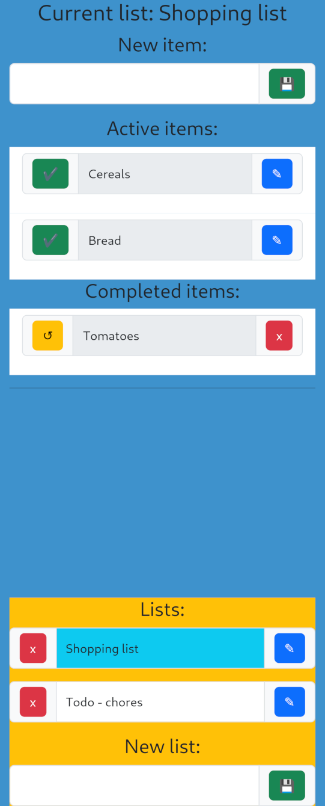

# Simple lists

A simple one-page todo list application created for self-hosting. I use this todo list application daily for managing tasks and staying organized. The application, developed using Haskell for the backend, Purescript for the frontend, and SQLite for simplicity in deployment, is designed to be lightweight, functional, and easy to set up without the need for user accounts or login credentials.

## Features

- **Minimalistic Design:** Focuses on essential todo list functionalities without unnecessary complexities.
- **Multiple Lists:** Supports the organization of tasks by allowing the creation of multiple todo lists.
- **Task Management:** Basic operations include adding new entries, marking tasks as done, unmarking completed tasks, and deleting entries.

## Getting started

1. Download and adjust example [docker-compose.yml](examples/docker-compose.yml) file.
2. Run using `docker compose up -d`.

## Screenshots

## Building OCI image on NixOS with Flake and Podman support enabled 

1. Clone the repository.
2. Allow direnv or run `nix develop --impure`.
3. Run `.\build.sh` to generate `result` OCI image (tar archive).

## Note on Frontend

While the frontend may not boast intricate design elements, it effectively serves its purpose. Contributions and improvements to enhance the user interface are welcome.

## Contributions

Feel free to contribute, report issues, or suggest enhancements. Your input is highly valued, especially for improving the frontend experience.

## License

This project is licensed under the MIT License - see the [LICENSE](LICENSE) file for details.